# 📘 คู่มือการใช้งานระบบกิจการนักเรียนดอยหัวเสือ

เอกสารฉบับนี้จัดทำขึ้นเพื่อใช้เป็นแนวทางประกอบการอบรม การดำเนินงาน และการอ้างอิงในการใช้งานระบบภายในสถานศึกษา โดยมุ่งเน้นความชัดเจนของสาระสำคัญ ลำดับการทำงาน และความสอดคล้องกับการใช้งานจริงของหน่วยงาน

## 🌐 1. ภาพรวมของระบบ

ระบบกิจการนักเรียนดอยหัวเสือเป็นเว็บแอปพลิเคชันสำหรับสนับสนุนงานดูแลช่วยเหลือนักเรียนในแต่ละวัน โดยบูรณาการภารกิจสำคัญไว้ภายในระบบเดียว ได้แก่

- ✅ เช็คชื่อหน้าเสาธง
- 📊 สรุปการมาเรียนรายคน
- ⏰ บันทึกมาสาย
- 🚶 ขอออกนอกบริเวณและสแกนออก-กลับ
- ⭐ จัดการคะแนนความประพฤติ
- 🧠 ประเมิน SDQ
- 👩‍🏫 จัดการครูที่ปรึกษา
- 👤 จัดการผู้ใช้งาน
- 🧑‍🎓 พอร์ทัลนักเรียน
- 📝 ใบลาของนักเรียน
- 🎓 เลื่อนชั้นนักเรียน
- ⚙️ ตั้งค่าปีการศึกษาและวันหยุด

ระบบนี้ทำงานบน Cloudflare เป็นหลัก โดยใช้ Cloudflare Workers สำหรับ runtime และ Cloudflare D1 สำหรับฐานข้อมูล

## 🎯 2. เป้าหมายของระบบ

ระบบนี้ถูกออกแบบมาเพื่อแก้ปัญหา 4 เรื่องหลัก

1. ลดงานกระดาษและการจดซ้ำ
2. ให้ครูและเจ้าหน้าที่เห็นข้อมูลนักเรียนแบบทันที
3. ให้ข้อมูลการมาเรียน มาสาย ลา และพฤติกรรมเชื่อมกัน
4. สนับสนุนให้นักเรียนสามารถตรวจสอบข้อมูลของตนเองได้อย่างเป็นระบบ

## 👥 3. บทบาทผู้ใช้งาน

ระบบรองรับ 4 บทบาทหลัก

### 👑 3.1 ผู้ดูแลระบบ `admin`

สิทธิ์หลัก:

- จัดการผู้ใช้งาน
- จัดการครูที่ปรึกษา
- จัดการนักเรียน
- ตั้งค่าระบบ
- เลื่อนชั้น
- ดูและแก้ไขข้อมูลได้ทุกส่วน

### 👩‍🏫 3.2 ครู `teacher`

สิทธิ์หลัก:

- เช็คชื่อหน้าเสาธง
- ดูข้อมูลนักเรียนในความดูแล
- ดูสรุปการมาเรียนรายคนของนักเรียนในขอบเขตที่ได้รับสิทธิ์
- ลงทะเบียนออกนอกบริเวณ
- ดูและแก้ไขคะแนนความประพฤติในขอบเขตที่ได้รับสิทธิ์
- เห็นใบลาของนักเรียนในหน้าเช็คชื่อ

หมายเหตุ:

- ครูที่ปรึกษาจะเห็นห้องของตนเองขึ้นก่อนในหลายหน้า
- หน้า `เช็คชื่อ`, `สรุปการมาเรียน`, `คะแนนความประพฤติ`, และ `ประเมิน SDQ` จะตั้ง `ชั้น/ห้องของครู` เป็นค่าเริ่มต้นให้ก่อน
- ถ้าครูเป็นหัวหน้าระดับหรือมี `levelScope` ระบบจะให้ขยับไปดูห้องอื่นในขอบเขตที่ได้รับสิทธิ์ได้
- ถ้าครูมีสิทธิ์ไม่ครบทุกห้อง ระบบจะจำกัดข้อมูลตามสิทธิ์

### 🧰 3.3 เจ้าหน้าที่ `staff`

สิทธิ์หลัก:

- บันทึกมาสาย
- เช็คชื่อหน้าเสาธง
- จัดการออกนอกบริเวณ
- ใช้งานจุดสแกน
- ดูข้อมูลนักเรียน
- ดูสรุปการมาเรียนรายคนได้ทุกห้อง
- ดูข้อมูลครูที่ปรึกษา
- จัดการคะแนนความประพฤติ

### 🧑‍🎓 3.4 นักเรียน `student`

สิทธิ์หลัก:

- ดูคะแนนความประพฤติของตัวเอง
- ดูประวัติการถูกเพิ่มและหักคะแนน
- ยื่นใบลา
- ดูสถานะใบลาของตัวเอง

## 🗺️ 4. หน้าใช้งานหลักของระบบ

### 🏠 4.1 หน้าหลักของระบบ

- `/login` หน้าเข้าสู่ระบบ
- `/dashboard` หน้าหลักสำหรับผู้ดูแล ครู และเจ้าหน้าที่
- `/student` หน้าหลักของนักเรียน

### 🛠️ 4.2 หน้าภายในแดชบอร์ด

- `/dashboard/attendance` เช็คชื่อหน้าเสาธง
- `/dashboard/attendance-summary` สรุปการมาเรียน
- `/dashboard/late-checkin` บันทึกมาสาย
- `/dashboard/leave-requests` ขอออกนอกบริเวณ
- `/dashboard/leave-checkpoint` จุดสแกนออก-กลับ
- `/dashboard/behavior` คะแนนความประพฤติ
- `/dashboard/score-rules` เกณฑ์คะแนน
- `/dashboard/sdq` ประเมิน SDQ
- `/dashboard/students` รายชื่อนักเรียน
- `/dashboard/teachers` ครูที่ปรึกษา
- `/dashboard/teacher-registrations` ลงทะเบียนครู
- `/dashboard/users` ผู้ใช้งาน
- `/dashboard/promotions` เลื่อนชั้น
- `/dashboard/settings` ตั้งค่าระบบ

### 🧑‍🎓 4.3 หน้าภายในพอร์ทัลนักเรียน

- `/student` หน้าหลักของนักเรียน
- `/student/behavior` ดูคะแนนความประพฤติ
- `/student/leave` ยื่นและติดตามใบลา
- `/student/sdq` ประเมิน SDQ ของนักเรียน

### 🌍 4.4 หน้าสาธารณะ

- `/late-checkin` จุดบันทึกมาสาย
- `/leave-checkpoint` จุดสแกนออก-กลับ
- `/register/teacher` หน้าสมัครครู
- `/register/teacher/success` หน้าสรุปผลหลังส่งคำขอสมัครครู
- `/sdq/parent` หน้าประเมิน SDQ สำหรับผู้ปกครอง

หน้าสาธารณะเหมาะสำหรับเปิดค้างไว้ที่จุดใช้งานจริง เช่น จุดสแกนหน้าประตูหรือจุดออกนอกบริเวณ

### 🖨️ 4.5 หน้าพิมพ์และหน้าช่วยงาน

- `/attendance-summary-print` หน้าพิมพ์สรุปการมาเรียน

## 🔐 5. การเข้าสู่ระบบ

### 👨‍💼 5.1 ผู้ดูแล ครู และเจ้าหน้าที่

1. เข้า `/login`
2. กรอกชื่อผู้ใช้
3. กรอกรหัสผ่าน
4. กด `เข้าสู่ระบบ`
5. ระบบจะพาไป `/dashboard`

### 🧑‍🎓 5.2 นักเรียน

1. เข้า `/login`
2. กรอก `ชื่อผู้ใช้ = เลขประจำตัวนักเรียน`
3. กรอก `รหัสผ่าน = เลขประจำตัวนักเรียน`
4. กด `เข้าสู่ระบบ`
5. ระบบจะพาไป `/student`

หมายเหตุ:

- นักเรียน login จากข้อมูลใน `students` โดยตรง ไม่ต้องมีบัญชีแยกในเมนู `ผู้ใช้งาน`
- ถ้าไม่มีการใช้งานเกิน 30 นาที ระบบจะให้ออกจากระบบและ login ใหม่

## 🧱 6. โครงสร้างสถาปัตยกรรมระบบ

ส่วนนี้อธิบายโครงสร้างการแบ่งชั้นการทำงานของระบบในภาพรวม

### 🏗️ 6.1 โครงสร้างระดับสูง

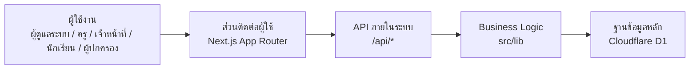
```mermaid
flowchart LR
    U["ผู้ใช้งาน<br/>ผู้ดูแลระบบ / ครู / เจ้าหน้าที่ / นักเรียน / ผู้ปกครอง"]
    F["ส่วนติดต่อผู้ใช้<br/>Next.js App Router"]
    A["API ภายในระบบ<br/>/api/*"]
    B["Business Logic<br/>src/lib"]
    D["ฐานข้อมูลหลัก<br/>Cloudflare D1"]

    U --> F
    F --> A
    A --> B
    B --> D
```

### 🧭 6.1.1 แผนภาพความสัมพันธ์เชิงแนวคิด

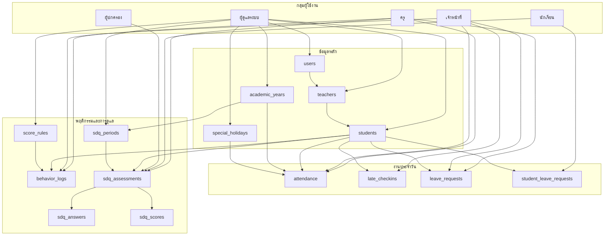
```mermaid
flowchart TB
    subgraph Actors["กลุ่มผู้ใช้งาน"]
        Admin["ผู้ดูแลระบบ"]
        Teacher["ครู"]
        Staff["เจ้าหน้าที่"]
        Student["นักเรียน"]
        Parent["ผู้ปกครอง"]
    end

    subgraph Core["ข้อมูลหลัก"]
        Users["users"]
        Teachers["teachers"]
        Students["students"]
        Years["academic_years"]
        Holidays["special_holidays"]
    end

    subgraph Daily["งานประจำวัน"]
        Attendance["attendance"]
        Late["late_checkins"]
        Leave["leave_requests"]
        StudentLeave["student_leave_requests"]
    end

    subgraph Behavior["พฤติกรรมและการดูแล"]
        BehaviorLogs["behavior_logs"]
        ScoreRules["score_rules"]
        SdqPeriods["sdq_periods"]
        SdqAssessments["sdq_assessments"]
        SdqAnswers["sdq_answers"]
        SdqScores["sdq_scores"]
    end

    Admin --> Users
    Admin --> Teachers
    Admin --> Students
    Admin --> Years
    Admin --> Holidays
    Admin --> ScoreRules
    Admin --> SdqPeriods

    Teacher --> Attendance
    Teacher --> Leave
    Teacher --> BehaviorLogs
    Teacher --> SdqAssessments

    Staff --> Attendance
    Staff --> Late
    Staff --> Leave
    Staff --> BehaviorLogs

    Student --> StudentLeave
    Student --> SdqAssessments
    Parent --> SdqAssessments

    Users --> Teachers
    Teachers --> Students
    Students --> Attendance
    Students --> Late
    Students --> Leave
    Students --> StudentLeave
    Students --> BehaviorLogs
    Students --> SdqAssessments

    ScoreRules --> BehaviorLogs
    SdqPeriods --> SdqAssessments
    SdqAssessments --> SdqAnswers
    SdqAssessments --> SdqScores
    Years --> Attendance
    Years --> SdqPeriods
    Holidays --> Attendance
```

### 🔄 6.1.2 ภาพรวมสถาปัตยกรรมการไหลข้อมูล

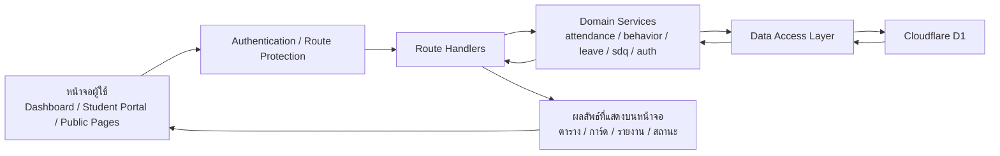
```mermaid
flowchart LR
    UI["หน้าจอผู้ใช้<br/>Dashboard / Student Portal / Public Pages"]
    Middleware["Authentication / Route Protection"]
    API["Route Handlers"]
    Service["Domain Services<br/>attendance / behavior / leave / sdq / auth"]
    Query["Data Access Layer"]
    D1["Cloudflare D1"]
    Output["ผลลัพธ์ที่แสดงบนหน้าจอ<br/>ตาราง / การ์ด / รายงาน / สถานะ"]

    UI --> Middleware
    Middleware --> API
    API --> Service
    Service --> Query
    Query --> D1
    D1 --> Query
    Query --> Service
    Service --> API
    API --> Output
    Output --> UI
```

### 🔩 6.2 ส่วนประกอบหลัก

- `Frontend`
  ใช้ Next.js App Router แสดงหน้า dashboard, หน้า login, หน้า public และพอร์ทัลนักเรียน

- `Backend API`
  ใช้ Route Handlers ใน `src/app/api` เป็น API ภายใน เช่น auth, attendance, behavior, leave requests และ students

- `Authentication`
  ใช้ cookie session และ middleware สำหรับควบคุมสิทธิ์การเข้าถึงหน้าและ API

- `Business Logic`
  เก็บใน `src/lib` เช่น กฎการหักคะแนน การตรวจสิทธิ์ การคำนวณสถานะ และการเชื่อมข้อมูลหลายตาราง

- `Database`
  ใช้ Cloudflare D1 เป็นฐานข้อมูลหลักของระบบ

### 🧩 6.3 โมดูลหลักของระบบ

- `โมดูลยืนยันตัวตน`
  login, logout, เปลี่ยนรหัสผ่าน, session timeout

- `โมดูลข้อมูลหลัก`
  users, teachers, students, academic years, holidays

- `โมดูลงานประจำวัน`
  attendance, late check-in, leave checkpoint

- `โมดูลพฤติกรรม`
  behavior score, behavior logs, score rules

- `โมดูล SDQ`
  sdq periods, teacher assessment, student self-assessment, parent public assessment, summary dashboard

- `โมดูลนักเรียน`
  student portal, student leave requests, ดูคะแนนของตัวเอง

- `โมดูลลงทะเบียนครู`
  teacher directory, teacher registration requests, approve / reset, import CSV

### 🗄️ 6.4 ตารางฐานข้อมูลหลัก

- `users` บัญชีผู้ใช้ของระบบ
- `teachers` ข้อมูลครูที่ปรึกษาและสิทธิ์ที่เกี่ยวข้อง
- `teacher_directory` รายชื่อครูที่เปิดให้ลงทะเบียน
- `teacher_registration_requests` คำขอลงทะเบียนครูที่รอแอดมินอนุมัติ
- `students` ข้อมูลนักเรียนหลัก
- `attendance` การเช็คชื่อประจำวัน
- `late_checkins` รายการมาสาย
- `leave_requests` คำขอออกนอกบริเวณ
- `behavior_logs` ประวัติการเพิ่มและหักคะแนน
- `score_rules` กฎคะแนน
- `sdq_periods` รอบประเมิน SDQ
- `sdq_assessments` หัวรายการประเมิน SDQ
- `sdq_answers` คำตอบรายข้อของ SDQ
- `sdq_scores` คะแนนสรุป SDQ
- `academic_years` ปีการศึกษา
- `special_holidays` วันหยุดพิเศษ
- `student_leave_requests` ใบลาของนักเรียน

### 📚 6.5 Data Dictionary

ส่วนนี้อธิบาย field สำคัญของแต่ละตารางแบบย่อ เพื่อใช้คุยงาน อ้างอิงตอนติดตั้ง และช่วยให้เข้าใจความหมายของข้อมูลได้เร็ว

#### 👤 ตาราง `users`

| ฟิลด์ | ชนิดข้อมูล | ความหมาย |
|---|---|---|
| `id` | TEXT | รหัสหลักของผู้ใช้ |
| `username` | TEXT | ชื่อผู้ใช้สำหรับ login |
| `passwordHash` | TEXT | รหัสผ่านที่ถูกเข้ารหัสแล้ว |
| `roles` | TEXT | รายการบทบาทในรูปแบบ JSON เช่น admin, teacher, staff |
| `firstName` | TEXT | ชื่อ |
| `lastName` | TEXT | นามสกุล |
| `teacherId` | TEXT | อ้างถึงครู ถ้าบัญชีนี้เป็นครู |
| `staffId` | TEXT | อ้างถึงเจ้าหน้าที่ ถ้ามี |
| `isActive` | INTEGER | สถานะเปิดใช้งานบัญชี |
| `mustChangePassword` | INTEGER | บังคับเปลี่ยนรหัสผ่านหลัง login หรือไม่ |
| `createdAt` | TEXT | วันที่สร้างบัญชี |

#### 👩‍🏫 ตาราง `teachers`

| ฟิลด์ | ชนิดข้อมูล | ความหมาย |
|---|---|---|
| `id` | TEXT | รหัสหลักของข้อมูลครู |
| `userId` | TEXT | อ้างถึงบัญชีใน `users` |
| `firstName` | TEXT | ชื่อครู |
| `lastName` | TEXT | นามสกุลครู |
| `grade` | INTEGER | ระดับชั้นที่ดูแล |
| `room` | INTEGER | ห้องที่ดูแล |
| `isHeadOfLevel` | INTEGER | เป็นหัวหน้าระดับหรือไม่ |
| `isDisciplineTeacher` | INTEGER | เป็นครูฝ่ายปกครองหรือไม่ |
| `levelScope` | INTEGER | ขอบเขตระดับชั้นที่รับผิดชอบ |
| `phone` | TEXT | เบอร์ติดต่อ |
| `createdAt` | TEXT | วันที่สร้างข้อมูล |

#### 🗂️ ตาราง `teacher_directory`

| ฟิลด์ | ชนิดข้อมูล | ความหมาย |
|---|---|---|
| `id` | TEXT | รหัสหลักของรายชื่อครู |
| `prefix` | TEXT | คำนำหน้าเดิม ถ้ามี |
| `firstName` | TEXT | ใช้เก็บชื่อเต็มของครูในระบบปัจจุบัน |
| `lastName` | TEXT | เว้นว่างได้ ถ้าใช้ชื่อเต็มช่องเดียว |
| `phone` | TEXT | ช่องสำรองเดิมของรายชื่อครู |
| `isActive` | INTEGER | เปิดให้ลงทะเบียนหรือไม่ |
| `isRegistered` | INTEGER | ครูคนนี้ถูกอนุมัติและสร้างบัญชีแล้วหรือยัง |
| `currentUserId` | TEXT | อ้างถึงบัญชีผู้ใช้ที่สร้างจากคำขอนี้ |
| `currentTeacherId` | TEXT | อ้างถึงข้อมูลครูในตาราง `teachers` |
| `createdAt` | TEXT | วันที่เพิ่มรายชื่อ |
| `updatedAt` | TEXT | วันที่แก้ไขล่าสุด |

#### 📨 ตาราง `teacher_registration_requests`

| ฟิลด์ | ชนิดข้อมูล | ความหมาย |
|---|---|---|
| `id` | TEXT | รหัสคำขอลงทะเบียน |
| `teacherDirectoryId` | TEXT | อ้างถึงรายชื่อครูที่เปิดให้ลงทะเบียน |
| `username` | TEXT | ชื่อผู้ใช้ที่ครูตั้งเอง |
| `passwordHash` | TEXT | รหัสผ่านที่เข้ารหัสแล้ว |
| `phone` | TEXT | เบอร์โทรที่ครูกรอกเองตอนสมัคร |
| `grade` | INTEGER | ชั้นที่ครูระบุว่าดูแล |
| `room` | INTEGER | ห้องที่ครูระบุว่าดูแล |
| `status` | TEXT | สถานะคำขอ เช่น pending, approved, rejected, reset |
| `submittedAt` | TEXT | วันที่ส่งคำขอ |
| `reviewedAt` | TEXT | วันที่แอดมินตรวจคำขอ |
| `reviewedBy` | TEXT | ผู้ตรวจคำขอ |
| `reviewedByName` | TEXT | ชื่อผู้ตรวจคำขอ |
| `reviewNote` | TEXT | หมายเหตุจากการพิจารณา |
| `createdUserId` | TEXT | บัญชีผู้ใช้ที่ถูกสร้างตอนอนุมัติ |
| `createdTeacherId` | TEXT | ข้อมูลครูที่ถูกสร้างตอนอนุมัติ |

#### 🧑‍🎓 ตาราง `students`

| ฟิลด์ | ชนิดข้อมูล | ความหมาย |
|---|---|---|
| `id` | TEXT | รหัสหลักของนักเรียน |
| `studentId` | TEXT | เลขประจำตัวนักเรียน |
| `studentCardId` | TEXT | รหัสบัตร RFID |
| `prefix` | TEXT | คำนำหน้า |
| `firstName` | TEXT | ชื่อ |
| `lastName` | TEXT | นามสกุล |
| `grade` | INTEGER | ระดับชั้น |
| `room` | INTEGER | ห้อง |
| `behaviorScore` | INTEGER | คะแนนความประพฤติคงเหลือ |
| `isActive` | INTEGER | สถานะกำลังใช้งานในระบบ |
| `studyStatus` | TEXT | สถานะการเรียน เช่น studying, graduated, withdrawn |
| `lastPromotionAcademicYearId` | TEXT | ปีการศึกษาที่เลื่อนชั้นล่าสุด |
| `graduatedAt` | TEXT | วันที่จบการศึกษา |
| `graduationAcademicYearId` | TEXT | ปีการศึกษาที่จบ |
| `createdAt` | TEXT | วันที่สร้างข้อมูล |

#### ✅ ตาราง `attendance`

| ฟิลด์ | ชนิดข้อมูล | ความหมาย |
|---|---|---|
| `id` | TEXT | รหัสรายการเช็คชื่อ |
| `date` | TEXT | วันที่เช็คชื่อ |
| `studentId` | TEXT | อ้างถึงนักเรียน |
| `grade` | INTEGER | ชั้นของนักเรียน ณ วันที่บันทึก |
| `room` | INTEGER | ห้องของนักเรียน ณ วันที่บันทึก |
| `status` | TEXT | สถานะ เช่น present, absent, late, leave_sick, leave_personal |
| `recordedBy` | TEXT | ผู้บันทึก |
| `recordedAt` | TEXT | วันเวลาในการบันทึก |
| `source` | TEXT | ที่มาของข้อมูล เช่น manual หรือ late_scan |
| `lockedByLate` | INTEGER | ถูกล็อกจากระบบมาสายหรือไม่ |
| `lateCheckInId` | TEXT | อ้างถึงรายการมาสายที่เกี่ยวข้อง |

#### ⏰ ตาราง `late_checkins`

| ฟิลด์ | ชนิดข้อมูล | ความหมาย |
|---|---|---|
| `id` | TEXT | รหัสรายการมาสาย |
| `date` | TEXT | วันที่มาสาย |
| `studentId` | TEXT | อ้างถึงนักเรียน |
| `grade` | INTEGER | ชั้นของนักเรียน |
| `room` | INTEGER | ห้องของนักเรียน |
| `scanValue` | TEXT | ค่าที่ใช้สแกน เช่น RFID หรือเลขประจำตัว |
| `matchedBy` | TEXT | วิธีที่ระบบจับคู่ เช่น student_id หรือ rfid |
| `channel` | TEXT | มาจากจุดสแกน public หรือ internal |
| `recordedBy` | TEXT | ผู้บันทึก |
| `recordedByName` | TEXT | ชื่อผู้บันทึก |
| `recordedAt` | TEXT | วันเวลาที่บันทึก |
| `behaviorDeducted` | INTEGER | หักคะแนนแล้วหรือยัง |

#### 🚶 ตาราง `leave_requests`

| ฟิลด์ | ชนิดข้อมูล | ความหมาย |
|---|---|---|
| `id` | TEXT | รหัสคำขอออกนอกบริเวณ |
| `date` | TEXT | วันที่ทำรายการ |
| `studentId` | TEXT | อ้างถึงนักเรียน |
| `grade` | INTEGER | ชั้นของนักเรียน |
| `room` | INTEGER | ห้องของนักเรียน |
| `requestedBy` | TEXT | ผู้สร้างคำขอ |
| `requestedByName` | TEXT | ชื่อผู้สร้างคำขอ |
| `plannedDepartureAt` | TEXT | เวลาออกที่วางแผนไว้ |
| `plannedReturnAt` | TEXT | เวลากลับที่วางแผนไว้ |
| `noReturn` | INTEGER | ไม่กลับเข้าโรงเรียนหรือไม่ |
| `destination` | TEXT | สถานที่ปลายทาง |
| `travelMode` | TEXT | รูปแบบการเดินทาง |
| `contactPhone` | TEXT | เบอร์ติดต่อ |
| `note` | TEXT | หมายเหตุ |
| `status` | TEXT | สถานะคำขอ เช่น pending_departure, departed, returned_late |
| `actualDepartureAt` | TEXT | เวลาออกจริง |
| `actualReturnAt` | TEXT | เวลากลับจริง |
| `lateDeducted` | INTEGER | หักคะแนนกรณีกลับช้าแล้วหรือยัง |
| `missingReturnDeducted` | INTEGER | หักคะแนนกรณีไม่กลับแล้วหรือยัง |
| `createdAt` | TEXT | วันที่สร้างรายการ |

#### ⭐ ตาราง `behavior_logs`

| ฟิลด์ | ชนิดข้อมูล | ความหมาย |
|---|---|---|
| `id` | TEXT | รหัสรายการพฤติกรรม |
| `studentId` | TEXT | อ้างถึงนักเรียน |
| `studentName` | TEXT | ชื่อนักเรียน ณ เวลาบันทึก |
| `scoreBefore` | INTEGER | คะแนนก่อนเปลี่ยน |
| `scoreChange` | INTEGER | คะแนนที่เพิ่มหรือหัก |
| `scoreAfter` | INTEGER | คะแนนหลังเปลี่ยน |
| `type` | TEXT | ประเภท add หรือ deduct |
| `reason` | TEXT | เหตุผล |
| `ruleId` | TEXT | อ้างถึงกฎคะแนนถ้ามี |
| `performedBy` | TEXT | ผู้ดำเนินการ |
| `performedByName` | TEXT | ชื่อผู้ดำเนินการ |
| `createdAt` | TEXT | วันเวลาที่บันทึก |

#### 📏 ตาราง `score_rules`

| ฟิลด์ | ชนิดข้อมูล | ความหมาย |
|---|---|---|
| `id` | TEXT | รหัสกฎคะแนน |
| `name` | TEXT | ชื่อกฎ |
| `type` | TEXT | ประเภท add หรือ deduct |
| `points` | INTEGER | จำนวนคะแนน |
| `category` | TEXT | หมวดหมู่ |
| `isActive` | INTEGER | เปิดใช้งานหรือไม่ |
| `createdAt` | TEXT | วันที่สร้างกฎ |

#### 📅 ตาราง `academic_years`

| ฟิลด์ | ชนิดข้อมูล | ความหมาย |
|---|---|---|
| `id` | TEXT | รหัสปีการศึกษา |
| `name` | TEXT | ชื่อปีการศึกษา |
| `term1Start` | TEXT | วันเปิดภาคเรียนที่ 1 |
| `term1End` | TEXT | วันปิดภาคเรียนที่ 1 |
| `term2Start` | TEXT | วันเปิดภาคเรียนที่ 2 |
| `term2End` | TEXT | วันปิดภาคเรียนที่ 2 |
| `isActive` | INTEGER | เป็นปีการศึกษาปัจจุบันหรือไม่ |
| `createdAt` | TEXT | วันที่สร้างข้อมูล |

#### 🎉 ตาราง `special_holidays`

| ฟิลด์ | ชนิดข้อมูล | ความหมาย |
|---|---|---|
| `id` | TEXT | รหัสวันหยุด |
| `date` | TEXT | วันที่หยุด |
| `name` | TEXT | ชื่อวันหยุด |
| `isActive` | INTEGER | ใช้งานอยู่หรือไม่ |
| `createdAt` | TEXT | วันที่สร้างข้อมูล |

#### 📝 ตาราง `student_leave_requests`

| ฟิลด์ | ชนิดข้อมูล | ความหมาย |
|---|---|---|
| `id` | TEXT | รหัสใบลา |
| `studentId` | TEXT | อ้างถึงนักเรียน |
| `grade` | INTEGER | ชั้นของนักเรียน |
| `room` | INTEGER | ห้องของนักเรียน |
| `date` | TEXT | วันที่ลา |
| `leaveType` | TEXT | ประเภทลา เช่น sick หรือ personal |
| `reason` | TEXT | เหตุผลการลา |
| `note` | TEXT | หมายเหตุเพิ่มเติม |
| `status` | TEXT | สถานะใบลา เช่น pending, recorded, cancelled |
| `createdAt` | TEXT | วันที่สร้างใบลา |
| `reviewedAt` | TEXT | วันที่ถูกนำไปใช้งานหรือถูกทบทวน |
| `reviewedBy` | TEXT | ผู้ที่ดำเนินการกับใบลา |
| `reviewedByName` | TEXT | ชื่อผู้ที่ดำเนินการ |
| `attendanceRecordId` | TEXT | อ้างถึง attendance ที่ใช้ใบลานี้ |

#### 🧠 ตาราง `sdq_periods`

| ฟิลด์ | ชนิดข้อมูล | ความหมาย |
|---|---|---|
| `id` | TEXT | รหัสรอบประเมิน |
| `name` | TEXT | ชื่อรอบประเมิน เช่น SDQ ปีการศึกษา 2569 |
| `academicYearId` | TEXT | อ้างถึงปีการศึกษาที่เกี่ยวข้อง |
| `term` | TEXT | ภาคเรียน |
| `isActive` | INTEGER | เป็นรอบที่เปิดใช้งานอยู่หรือไม่ |
| `allowTeacher` | INTEGER | เปิดให้ครูประเมินหรือไม่ |
| `allowStudent` | INTEGER | เปิดให้นักเรียนประเมินหรือไม่ |
| `allowParent` | INTEGER | เปิดให้ผู้ปกครองประเมินหรือไม่ |
| `startDate` | TEXT | วันที่เริ่มเปิดประเมิน |
| `endDate` | TEXT | วันที่สิ้นสุดการประเมิน |
| `createdAt` | TEXT | วันที่สร้างรอบประเมิน |

#### 🧾 ตาราง `sdq_assessments`

| ฟิลด์ | ชนิดข้อมูล | ความหมาย |
|---|---|---|
| `id` | TEXT | รหัสหัวรายการประเมิน |
| `studentId` | TEXT | อ้างถึงนักเรียน |
| `grade` | INTEGER | ชั้นของนักเรียนในรอบประเมินนั้น |
| `room` | INTEGER | ห้องของนักเรียนในรอบประเมินนั้น |
| `periodId` | TEXT | อ้างถึงรอบประเมิน SDQ |
| `evaluatorType` | TEXT | ผู้ประเมิน เช่น teacher, student, parent |
| `evaluatorUserId` | TEXT | อ้างถึงบัญชีผู้ประเมิน ถ้าเป็นครูหรือนักเรียน |
| `evaluatorName` | TEXT | ชื่อผู้ประเมินที่บันทึกไว้ |
| `status` | TEXT | สถานะ เช่น draft หรือ submitted |
| `submittedAt` | TEXT | วันที่ส่งแบบประเมิน |
| `createdAt` | TEXT | วันที่สร้างรายการ |
| `updatedAt` | TEXT | วันที่แก้ไขล่าสุด |

#### 🧩 ตาราง `sdq_answers`

| ฟิลด์ | ชนิดข้อมูล | ความหมาย |
|---|---|---|
| `id` | TEXT | รหัสคำตอบรายข้อ |
| `assessmentId` | TEXT | อ้างถึงหัวรายการประเมิน |
| `questionCode` | TEXT | รหัสข้อคำถาม เช่น q01 ถึง q25 |
| `answerValue` | INTEGER | ค่าคำตอบ 0, 1 หรือ 2 |
| `createdAt` | TEXT | วันที่บันทึกคำตอบ |

#### 📊 ตาราง `sdq_scores`

| ฟิลด์ | ชนิดข้อมูล | ความหมาย |
|---|---|---|
| `id` | TEXT | รหัสคะแนนสรุป |
| `assessmentId` | TEXT | อ้างถึงหัวรายการประเมิน |
| `emotional` | INTEGER | คะแนนด้านอารมณ์ |
| `conduct` | INTEGER | คะแนนด้านความประพฤติ |
| `hyperactivity` | INTEGER | คะแนนด้านสมาธิ/อยู่ไม่นิ่ง |
| `peer` | INTEGER | คะแนนด้านความสัมพันธ์กับเพื่อน |
| `prosocial` | INTEGER | คะแนนด้านสัมพันธภาพทางสังคม |
| `totalDifficulty` | INTEGER | คะแนนรวมด้านปัญหา |
| `interpretation` | TEXT | ผลแปลความ เช่น ปกติ เสี่ยง มีปัญหา |
| `createdAt` | TEXT | วันที่สร้างคะแนนสรุป |
| `updatedAt` | TEXT | วันที่แก้ไขคะแนนล่าสุด |

### 📁 6.6 โครงสร้างโค้ดหลัก

```text
src/
  app/
    api/                  # API ภายในระบบ
    dashboard/            # หน้าสำหรับ admin / teacher / staff
    student/              # พอร์ทัลนักเรียน
    sdq/parent/           # หน้าประเมิน SDQ สำหรับผู้ปกครอง
    late-checkin/         # จุดบันทึกมาสาย
    leave-checkpoint/     # จุดสแกนออก-กลับ
    login/                # หน้าเข้าสู่ระบบ
  components/             # ส่วนประกอบ UI
  lib/                    # auth, db, business logic
docs/
  user-guide.md           # คู่มือฉบับนี้
schema.sql                # โครงสร้างฐานข้อมูลสำหรับติดตั้งใหม่
```

## 🔄 7. กระบวนการทำงานของระบบ

ส่วนนี้อธิบายลำดับการทำงานของระบบในแต่ละกระบวนงาน รวมถึงเส้นทางการไหลของข้อมูลระหว่างผู้ใช้ หน้าจอ ระบบประมวลผล และฐานข้อมูล

### 🔐 7.1 กระบวนการเข้าสู่ระบบ

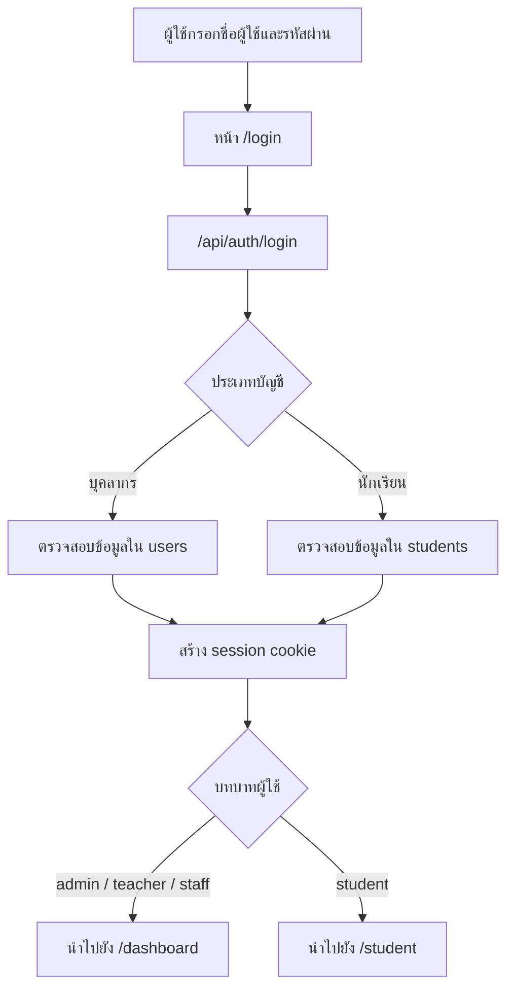
```mermaid
flowchart TD
    A["ผู้ใช้กรอกชื่อผู้ใช้และรหัสผ่าน"] --> B["หน้า /login"]
    B --> C["/api/auth/login"]
    C --> D{"ประเภทบัญชี"}
    D -->|บุคลากร| E["ตรวจสอบข้อมูลใน users"]
    D -->|นักเรียน| F["ตรวจสอบข้อมูลใน students"]
    E --> G["สร้าง session cookie"]
    F --> G
    G --> H{"บทบาทผู้ใช้"}
    H -->|admin / teacher / staff| I["นำไปยัง /dashboard"]
    H -->|student| J["นำไปยัง /student"]
```

ขั้นตอน:

1. ผู้ใช้กรอกชื่อผู้ใช้และรหัสผ่าน
2. หน้า login ส่งข้อมูลไป `/api/auth/login`
3. ถ้าเป็นนักเรียน ระบบตรวจใน `students` โดยตรง
4. ถ้าเป็นบุคลากร ระบบตรวจบัญชีใน `users`
5. ระบบสร้าง token และ cookie
6. พาไปหน้าตามบทบาทของผู้ใช้

### 👩‍🏫 7.1.1 กระบวนการลงทะเบียนครู

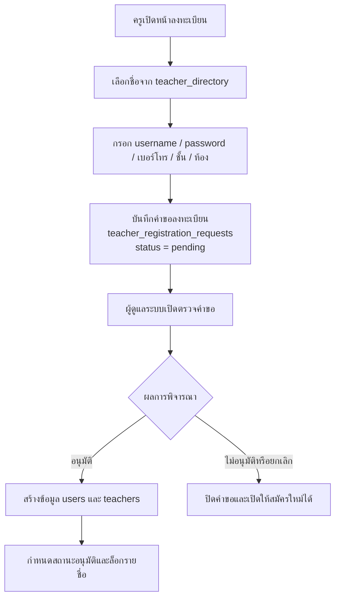
```mermaid
flowchart TD
    A["ครูเปิดหน้าลงทะเบียน"] --> B["เลือกชื่อจาก teacher_directory"]
    B --> C["กรอก username / password / เบอร์โทร / ชั้น / ห้อง"]
    C --> D["บันทึกคำขอลงทะเบียน<br/>teacher_registration_requests<br/>status = pending"]
    D --> E["ผู้ดูแลระบบเปิดตรวจคำขอ"]
    E --> F{"ผลการพิจารณา"}
    F -->|อนุมัติ| G["สร้างข้อมูล users และ teachers"]
    G --> H["กำหนดสถานะอนุมัติและล็อกรายชื่อ"]
    F -->|ไม่อนุมัติหรือยกเลิก| I["ปิดคำขอและเปิดให้สมัครใหม่ได้"]
```

ขั้นตอน:

1. แอดมินต้องเพิ่มรายชื่อครูก่อนในแท็บ `เพิ่มรายชื่อครู`
2. ครูเปิดหน้าสมัครและเลือกได้เฉพาะชื่อที่ยัง active และยังไม่ถูกอนุมัติ
3. ครูกรอก `username`, `password`, `เบอร์โทร`, `ชั้น`, `ห้อง`
4. ระบบเก็บคำขอไว้ใน `teacher_registration_requests`
5. แอดมินเปิดแท็บ `คำขอลงทะเบียน` เพื่อตรวจคำขอ
6. ถ้าอนุมัติ ระบบจะสร้างข้อมูลใน `users` และ `teachers` อัตโนมัติ
7. ถ้าคำขอถูกอนุมัติแล้ว จะไม่รีเซ็ตจากหน้านี้อีก ต้องไปแก้ต่อที่เมนู `ผู้ใช้งาน` หรือ `ครูที่ปรึกษา`
8. ถ้าคำขอยังไม่อนุมัติ แอดมินยังสามารถไม่อนุมัติหรือยกเลิกได้

### ✅ 7.2 กระบวนการเช็คชื่อหน้าเสาธง

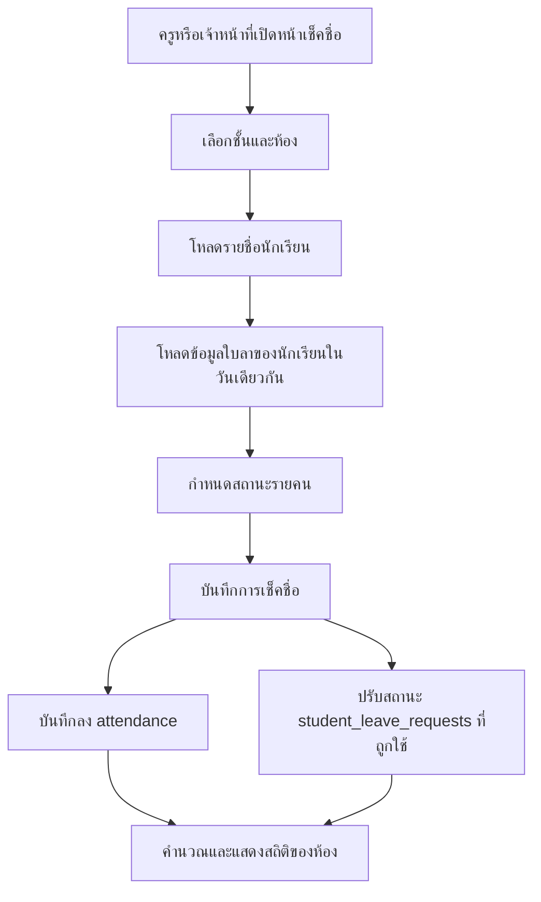
```mermaid
flowchart TD
    A["ครูหรือเจ้าหน้าที่เปิดหน้าเช็คชื่อ"] --> B["เลือกชั้นและห้อง"]
    B --> C["โหลดรายชื่อนักเรียน"]
    C --> D["โหลดข้อมูลใบลาของนักเรียนในวันเดียวกัน"]
    D --> E["กำหนดสถานะรายคน"]
    E --> F["บันทึกการเช็คชื่อ"]
    F --> G["บันทึกลง attendance"]
    F --> H["ปรับสถานะ student_leave_requests ที่ถูกใช้"]
    G --> I["คำนวณและแสดงสถิติของห้อง"]
    H --> I
```

ขั้นตอน:

1. ครูหรือเจ้าหน้าที่เปิดหน้าเช็คชื่อ
2. ถ้าเป็นครูที่ปรึกษา ระบบจะตั้ง `ชั้น/ห้องของครู` ให้ก่อน และถ้ามีสิทธิ์ระดับเพิ่มเติมจึงค่อยเปลี่ยนไปดูห้องอื่นใน scope ได้
3. ระบบโหลดนักเรียนของห้องนั้น
4. ระบบโหลดใบลาของนักเรียนในวันเดียวกันมาประกอบ
5. ผู้ใช้เลือกสถานะ เช่น มา ขาด มาสาย ลาป่วย ลากิจ
6. กดบันทึก
7. API บันทึกลง `attendance`
8. ถ้ามีใบลาที่ตรงกัน ระบบจะ mark ว่าใบลานั้นถูกใช้แล้ว
9. หน้าเลื่อนกลับขึ้นไปให้เห็นสถิติของห้อง

### 📊 7.2.1 กระบวนการสรุปการมาเรียน

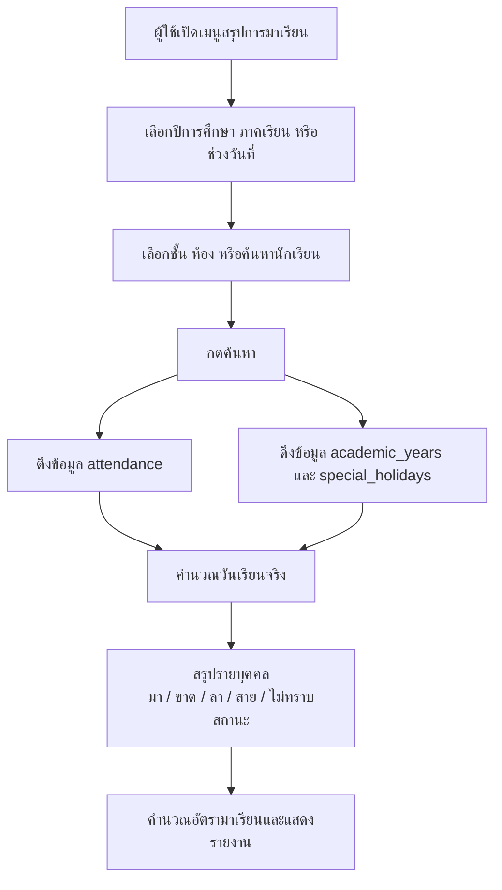
```mermaid
flowchart TD
    A["ผู้ใช้เปิดเมนูสรุปการมาเรียน"] --> B["เลือกปีการศึกษา ภาคเรียน หรือช่วงวันที่"]
    B --> C["เลือกชั้น ห้อง หรือค้นหานักเรียน"]
    C --> D["กดค้นหา"]
    D --> E["ดึงข้อมูล attendance"]
    D --> F["ดึงข้อมูล academic_years และ special_holidays"]
    E --> G["คำนวณวันเรียนจริง"]
    F --> G
    G --> H["สรุปรายบุคคล<br/>มา / ขาด / ลา / สาย / ไม่ทราบสถานะ"]
    H --> I["คำนวณอัตรามาเรียนและแสดงรายงาน"]
```

ขั้นตอน:

1. เปิดเมนู `สรุปการมาเรียน`
2. เลือก `ปีการศึกษา`
3. เลือกดู `ทั้งปี`, `ภาคเรียนที่ 1`, `ภาคเรียนที่ 2` หรือ `กำหนดช่วงวันที่เอง`
4. เลือก `ระดับชั้น` และ `ห้อง` หรือค้นหาชื่อนักเรียน
5. กด `ค้นหา`
6. ระบบดึงข้อมูลจาก `attendance`
7. ระบบตัด `วันเสาร์-อาทิตย์` และ `วันหยุดพิเศษ` ออกจากวันเรียน
8. ระบบสรุปให้รายคนว่า `มา`, `ขาด`, `ลา`, `มาสาย`, และ `ไม่ทราบสถานะ` กี่วัน
9. ระบบคำนวณ `มาเรียนจริง (%)` จาก `(มา + มาสาย) ÷ วันเรียนทั้งหมด`
10. ผู้ใช้เปิดดูสรุปรายคนหรือดาวน์โหลด CSV ได้

### ⏰ 7.3 กระบวนการบันทึกมาสาย

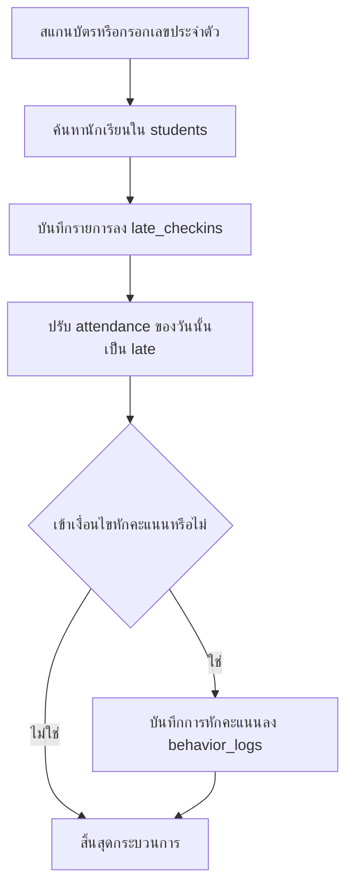
```mermaid
flowchart TD
    A["สแกนบัตรหรือกรอกเลขประจำตัว"] --> B["ค้นหานักเรียนใน students"]
    B --> C["บันทึกรายการลง late_checkins"]
    C --> D["ปรับ attendance ของวันนั้นเป็น late"]
    D --> E{"เข้าเงื่อนไขหักคะแนนหรือไม่"}
    E -->|ใช่| F["บันทึกการหักคะแนนลง behavior_logs"]
    E -->|ไม่ใช่| G["สิ้นสุดกระบวนการ"]
    F --> G
```

ขั้นตอน:

1. เจ้าหน้าที่เปิดหน้า `/late-checkin` หรือหน้าใน dashboard
2. สแกน RFID หรือกรอกเลขประจำตัว
3. ระบบค้นหานักเรียนใน `students`
4. ถ้าบัตรยังไม่ถูกผูก ระบบจะให้ผูกก่อน
5. บันทึกรายการลง `late_checkins`
6. ปรับสถานะการเช็คชื่อของวันนั้นเป็น `late`
7. ถ้าเข้าเงื่อนไข ระบบจะบันทึกการหักคะแนนลง `behavior_logs`

### 🚶 7.4 กระบวนการขอออกนอกบริเวณ

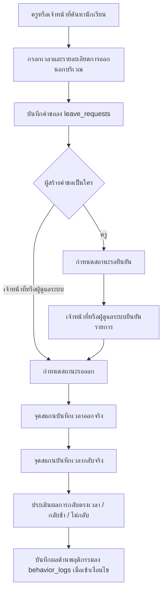
```mermaid
flowchart TD
    A["ครูหรือเจ้าหน้าที่ค้นหานักเรียน"] --> B["กรอกเวลาและรายละเอียดการออกนอกบริเวณ"]
    B --> C["บันทึกคำขอลง leave_requests"]
    C --> D{"ผู้สร้างคำขอเป็นใคร"}
    D -->|ครู| E["กำหนดสถานะรอยืนยัน"]
    D -->|เจ้าหน้าที่หรือผู้ดูแลระบบ| F["กำหนดสถานะรอออก"]
    E --> G["เจ้าหน้าที่หรือผู้ดูแลระบบยืนยันรายการ"]
    G --> F
    F --> H["จุดสแกนบันทึกเวลาออกจริง"]
    H --> I["จุดสแกนบันทึกเวลากลับจริง"]
    I --> J["ประเมินผลการกลับตรงเวลา / กลับช้า / ไม่กลับ"]
    J --> K["บันทึกผลด้านพฤติกรรมลง behavior_logs เมื่อเข้าเงื่อนไข"]
```

ขั้นตอน:

1. ครูหรือเจ้าหน้าที่ค้นหานักเรียน
2. กรอกเวลาออก เวลากลับ ปลายทาง การเดินทาง และเบอร์ติดต่อ
3. ระบบตรวจว่าข้อมูลเวลาใช้ได้หรือไม่
4. ระบบตรวจว่านักเรียนมีคำขอค้างอยู่หรือไม่
5. ถ้าเป็นครูที่ปรึกษาส่งคำขอ ระบบจะบันทึกเป็น `รอยืนยัน`
6. เจ้าหน้าที่หรือผู้ดูแลระบบกด `ยืนยันรายการ` แล้วคำขอจะเปลี่ยนเป็น `รอออก`
7. ถ้าเจ้าหน้าที่หรือผู้ดูแลระบบเป็นคนส่งคำขอเอง ระบบจะพร้อมสแกนทันที
8. เมื่อนักเรียนไปถึงจุดสแกน ระบบจะบันทึกเวลาออกจริง
9. ตอนนักเรียนกลับ ระบบจะบันทึกเวลากลับจริง
10. ถ้ากลับช้าหรือไม่กลับ ระบบอาจหักคะแนนและบันทึกลง `behavior_logs`

### 📝 7.5 กระบวนการใบลาของนักเรียน

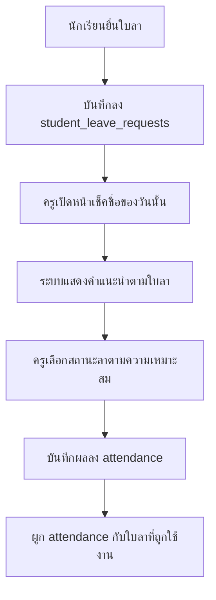
```mermaid
flowchart TD
    A["นักเรียนยื่นใบลา"] --> B["บันทึกลง student_leave_requests"]
    B --> C["ครูเปิดหน้าเช็คชื่อของวันนั้น"]
    C --> D["ระบบแสดงคำแนะนำตามใบลา"]
    D --> E["ครูเลือกสถานะลาตามความเหมาะสม"]
    E --> F["บันทึกผลลง attendance"]
    F --> G["ผูก attendance กับใบลาที่ถูกใช้งาน"]
```

ขั้นตอน:

1. นักเรียน login เข้าพอร์ทัลนักเรียน
2. เข้าเมนู `ใบลาของฉัน`
3. เลือกประเภทใบลา เช่น ลาป่วย หรือ ลากิจ
4. กรอกเหตุผลและวันที่ลา
5. ระบบบันทึกลง `student_leave_requests`
6. ครูเปิดหน้าเช็คชื่อของวันนั้น
7. ระบบดึงใบลานั้นมาแสดงใต้ชื่อนักเรียน
8. ปุ่มสถานะที่ตรงกับใบลาจะแสดง `ตามใบลา`
9. ครูบันทึกเช็คชื่อ และระบบจะผูกใบลากับ attendance

### ⭐ 7.6 กระบวนการคะแนนความประพฤติ

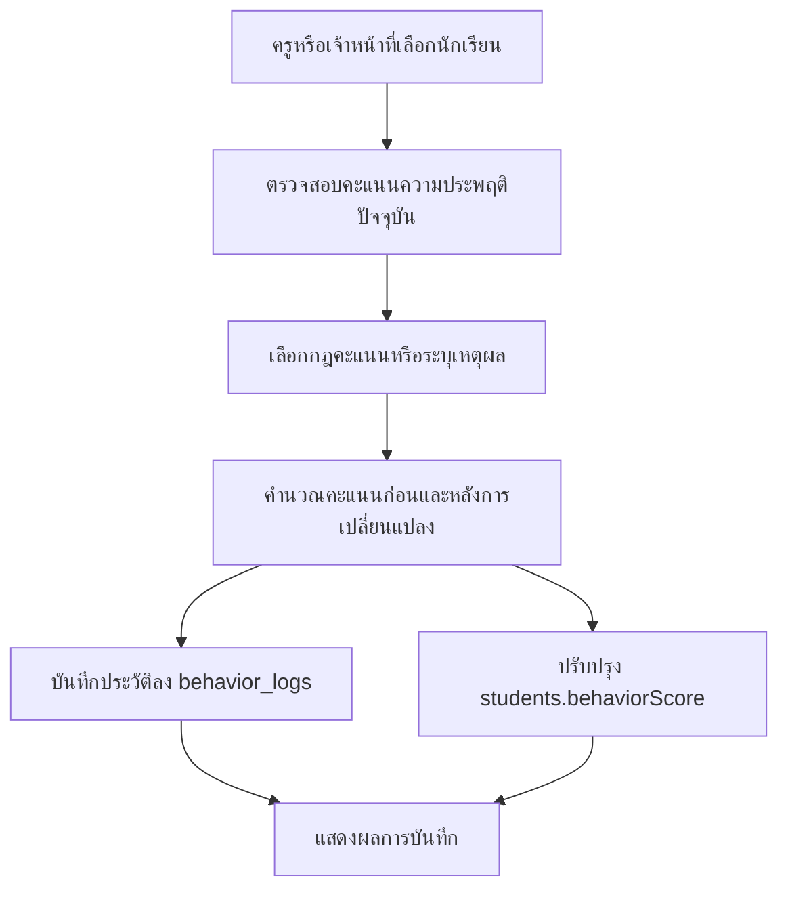
```mermaid
flowchart TD
    A["ครูหรือเจ้าหน้าที่เลือกนักเรียน"] --> B["ตรวจสอบคะแนนความประพฤติปัจจุบัน"]
    B --> C["เลือกกฎคะแนนหรือระบุเหตุผล"]
    C --> D["คำนวณคะแนนก่อนและหลังการเปลี่ยนแปลง"]
    D --> E["บันทึกประวัติลง behavior_logs"]
    D --> F["ปรับปรุง students.behaviorScore"]
    E --> G["แสดงผลการบันทึก"]
    F --> G
```

ขั้นตอน:

1. ครูหรือเจ้าหน้าที่เปิดหน้า `คะแนนความประพฤติ`
2. ถ้าเป็นครู ระบบจะตั้ง `ชั้น/ห้องของครู` ให้ก่อน แล้วจึงเปลี่ยนไปดูห้องอื่นใน scope ได้ถ้ามีสิทธิ์
3. เลือกชั้น ห้อง หรือค้นหานักเรียน
4. ระบบดึงคะแนนปัจจุบันและประวัติคะแนน
5. ผู้ใช้เลือกกฎคะแนนหรือกรอกเหตุผลเอง
6. ระบบคำนวณคะแนนก่อนและหลัง
7. บันทึกลง `behavior_logs`
8. อัปเดต `students.behaviorScore`

### 🧑‍🎓 7.7 กระบวนการนักเรียนดูคะแนนตัวเอง

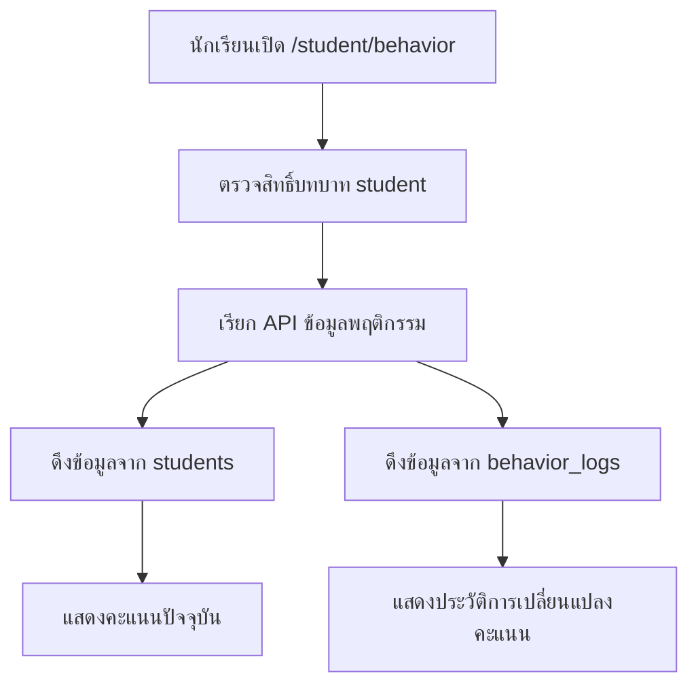
```mermaid
flowchart TD
    A["นักเรียนเปิด /student/behavior"] --> B["ตรวจสิทธิ์บทบาท student"]
    B --> C["เรียก API ข้อมูลพฤติกรรม"]
    C --> D["ดึงข้อมูลจาก students"]
    C --> E["ดึงข้อมูลจาก behavior_logs"]
    D --> F["แสดงคะแนนปัจจุบัน"]
    E --> G["แสดงประวัติการเปลี่ยนแปลงคะแนน"]
```

ขั้นตอน:

1. นักเรียน login
2. เข้า `/student/behavior`
3. ระบบตรวจ role ว่าเป็น `student`
4. API ดึงเฉพาะข้อมูลของนักเรียนคนนั้น
5. แสดงคะแนนคงเหลือและประวัติการเพิ่มหรือหักคะแนน

### 👩‍🏫 7.8 กระบวนการจัดการครูที่ปรึกษา

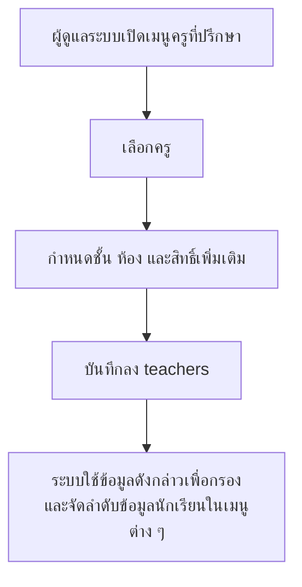
```mermaid
flowchart TD
    A["ผู้ดูแลระบบเปิดเมนูครูที่ปรึกษา"] --> B["เลือกครู"]
    B --> C["กำหนดชั้น ห้อง และสิทธิ์เพิ่มเติม"]
    C --> D["บันทึกลง teachers"]
    D --> E["ระบบใช้ข้อมูลดังกล่าวเพื่อกรองและจัดลำดับข้อมูลนักเรียนในเมนูต่าง ๆ"]
```

ขั้นตอน:

1. ผู้ดูแลเปิดหน้า `ครูที่ปรึกษา`
2. เลือกบัญชีครู
3. เลือกชั้นและห้อง
4. กำหนดสิทธิ์เพิ่มเติมถ้ามี
5. บันทึกลง `teachers`
6. ระบบใช้ข้อมูลนี้ในการเรียงและกรองข้อมูลนักเรียนในหน้าต่าง ๆ

### 🧠 7.9 กระบวนการประเมิน SDQ

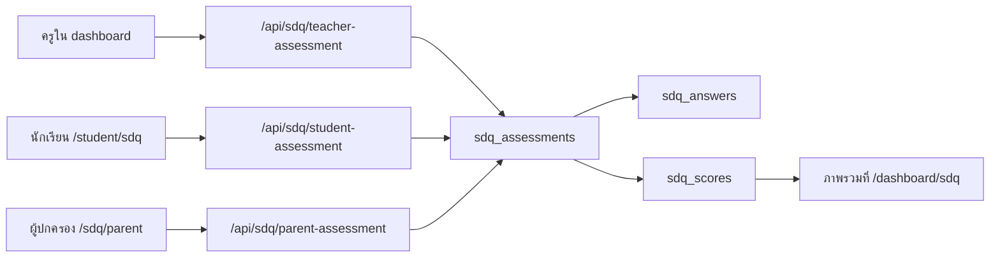
```mermaid
flowchart LR
    Teacher["ครูใน dashboard"] --> TeacherApi["/api/sdq/teacher-assessment"]
    Student["นักเรียน /student/sdq"] --> StudentApi["/api/sdq/student-assessment"]
    Parent["ผู้ปกครอง /sdq/parent"] --> ParentApi["/api/sdq/parent-assessment"]

    TeacherApi --> Assess["sdq_assessments"]
    StudentApi --> Assess
    ParentApi --> Assess

    Assess --> Answers["sdq_answers"]
    Assess --> Scores["sdq_scores"]
    Scores --> Overview["ภาพรวมที่ /dashboard/sdq"]
```

ขั้นตอน:

1. แอดมินสร้างและเปิด `รอบประเมิน SDQ`
2. เมนู `ประเมิน SDQ` แบ่งเป็นแท็บ `ภาพรวมการประเมิน` และ `จัดรอบประเมิน`
3. การสร้างหรือแก้ไขรอบประเมินทำผ่าน modal ในแท็บ `จัดรอบประเมิน`
4. ครูเข้าเมนู `ประเมิน SDQ` ใน dashboard โดยระบบจะตั้ง `ชั้น/ห้องของครู` เป็นค่าเริ่มต้นก่อน แล้วประเมินนักเรียนที่ตนมีสิทธิ์ดูแล
5. เจ้าหน้าที่เปิดหน้าเดียวกันได้แบบดูสรุป แต่ไม่ใช้ส่งแบบประเมินแทนครู
6. นักเรียนเข้าเมนู `/student/sdq` เพื่อประเมินตนเอง
7. ผู้ปกครองเข้า `/sdq/parent` แล้วกรอก `เลขประจำตัวนักเรียน` จากนั้นกด `ค้นหา` ก่อนจึงจะเข้าสู่แบบประเมิน
8. ระบบสร้างหรืออัปเดตรายการใน `sdq_assessments`
9. ระบบบันทึกคำตอบรายข้อใน `sdq_answers`
10. ระบบคำนวณคะแนนด้านต่าง ๆ และสรุปผลไว้ใน `sdq_scores`
11. แอดมิน ครู และเจ้าหน้าที่เปิด `/dashboard/sdq` เพื่อดูความคืบหน้าและผลสรุปของทั้ง 3 ฝั่ง

ข้อสังเกตสำคัญ:

- การแปลผลใช้ `คะแนนรวมด้านปัญหา` (`totalDifficulty`)
- ระบบแปลผลทันทีหลังส่งแบบประเมิน
- เกณฑ์ปัจจุบันคือ `0-13 = ปกติ`, `14-16 = เสี่ยง`, `17 ขึ้นไป = มีปัญหา`
- คะแนน `สัมพันธภาพทางสังคม (prosocial)` แสดงเป็นจุดแข็ง แต่ไม่ถูกรวมใน `totalDifficulty`
- badge ผลแปลของแต่ละฝั่งจะอยู่ `ใต้คำว่า ประเมินแล้ว`

### 📊 7.10 กระบวนการแดชบอร์ด

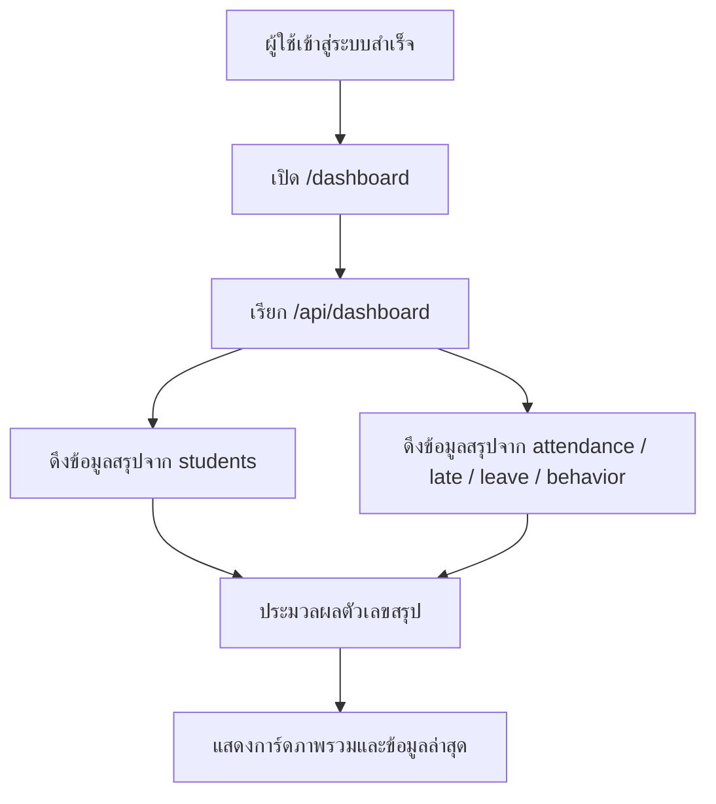
```mermaid
flowchart TD
    A["ผู้ใช้เข้าสู่ระบบสำเร็จ"] --> B["เปิด /dashboard"]
    B --> C["เรียก /api/dashboard"]
    C --> D["ดึงข้อมูลสรุปจาก students"]
    C --> E["ดึงข้อมูลสรุปจาก attendance / late / leave / behavior"]
    D --> F["ประมวลผลตัวเลขสรุป"]
    E --> F
    F --> G["แสดงการ์ดภาพรวมและข้อมูลล่าสุด"]
```

ขั้นตอน:

1. ผู้ใช้ที่เป็น `admin`, `teacher`, หรือ `staff` login เข้าระบบ
2. ระบบพาเข้า `/dashboard`
3. หน้า dashboard เรียก `/api/dashboard`
4. ระบบรวบรวมข้อมูลสรุปจากนักเรียน การเช็คชื่อ การมาสาย การลา และพฤติกรรม
5. แสดงผลเป็นการ์ดสรุปและข้อมูลล่าสุดเพื่อใช้ตรวจความผิดปกติในแต่ละวัน

### 👤 7.11 กระบวนการจัดการผู้ใช้งาน

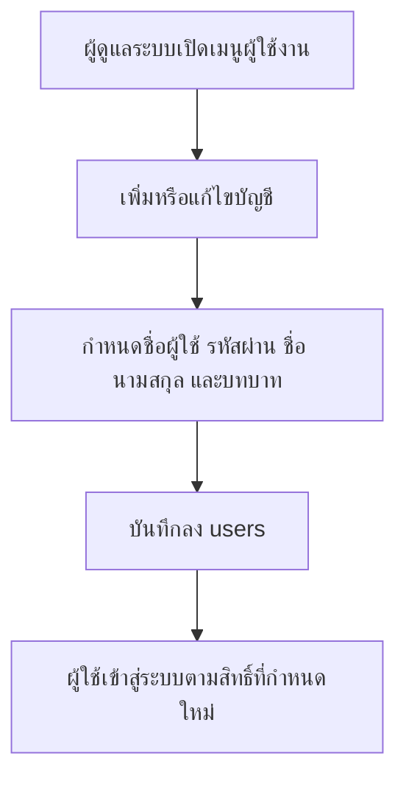
```mermaid
flowchart TD
    A["ผู้ดูแลระบบเปิดเมนูผู้ใช้งาน"] --> B["เพิ่มหรือแก้ไขบัญชี"]
    B --> C["กำหนดชื่อผู้ใช้ รหัสผ่าน ชื่อ นามสกุล และบทบาท"]
    C --> D["บันทึกลง users"]
    D --> E["ผู้ใช้เข้าสู่ระบบตามสิทธิ์ที่กำหนดใหม่"]
```

ขั้นตอน:

1. ผู้ดูแลเปิดเมนู `ผู้ใช้งาน`
2. เลือกเพิ่มผู้ใช้ใหม่ หรือแก้ไขบัญชีเดิม
3. กำหนดชื่อผู้ใช้ รหัสผ่าน ชื่อ นามสกุล และบทบาท
4. เปิดหรือปิดบัญชีตามความเหมาะสม
5. บันทึกข้อมูลลง `users`
6. ผู้ใช้ใหม่จะ login ได้ตามสิทธิ์ที่ถูกกำหนดไว้

### 🧑‍🎓 7.12 กระบวนการจัดการรายชื่อนักเรียน

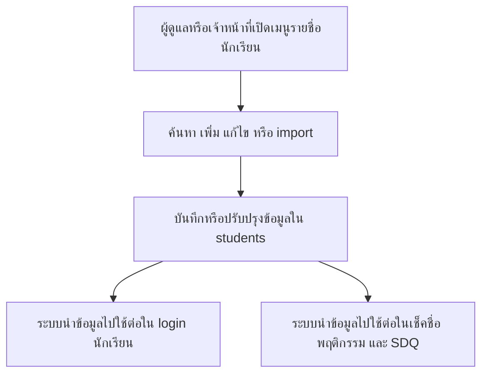
```mermaid
flowchart TD
    A["ผู้ดูแลหรือเจ้าหน้าที่เปิดเมนูรายชื่อนักเรียน"] --> B["ค้นหา เพิ่ม แก้ไข หรือ import"]
    B --> C["บันทึกหรือปรับปรุงข้อมูลใน students"]
    C --> D["ระบบนำข้อมูลไปใช้ต่อใน login นักเรียน"]
    C --> E["ระบบนำข้อมูลไปใช้ต่อในเช็คชื่อ พฤติกรรม และ SDQ"]
```

ขั้นตอน:

1. ผู้ดูแลหรือเจ้าหน้าที่เปิดเมนู `รายชื่อนักเรียน`
2. เลือกตัวกรอง `ระดับชั้น` และ `ห้อง` หรือค้นหาด้วยชื่อ/เลขประจำตัว
3. กด `ค้นหา` เพื่อโหลดรายการ
4. เพิ่ม แก้ไข หรือนำเข้าข้อมูลนักเรียนด้วยไฟล์ import
5. ระบบบันทึกลง `students`
6. ข้อมูลนี้จะถูกใช้ต่อในเมนู login นักเรียน เช็คชื่อ พฤติกรรม และ SDQ

### 📏 7.13 กระบวนการจัดการเกณฑ์คะแนน

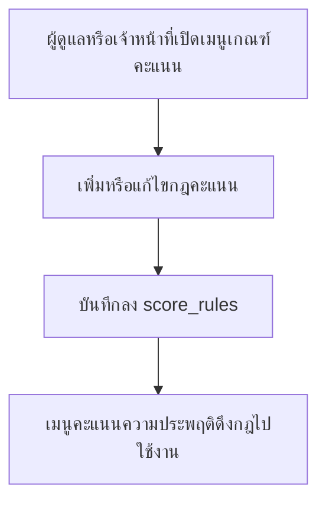
```mermaid
flowchart TD
    A["ผู้ดูแลหรือเจ้าหน้าที่เปิดเมนูเกณฑ์คะแนน"] --> B["เพิ่มหรือแก้ไขกฎคะแนน"]
    B --> C["บันทึกลง score_rules"]
    C --> D["เมนูคะแนนความประพฤติดึงกฎไปใช้งาน"]
```

ขั้นตอน:

1. ผู้ดูแลหรือเจ้าหน้าที่เปิดเมนู `เกณฑ์คะแนน`
2. สร้างกฎใหม่หรือแก้ไขกฎเดิม
3. กำหนดประเภท `เพิ่ม` หรือ `หัก`, จำนวนคะแนน, และหมวดหมู่
4. เปิดหรือปิดการใช้งานกฎนั้น
5. บันทึกลง `score_rules`
6. เมนู `คะแนนความประพฤติ` จะดึงกฎเหล่านี้ไปใช้ตอนบันทึกจริง

### ⚙️ 7.14 กระบวนการตั้งค่าระบบ

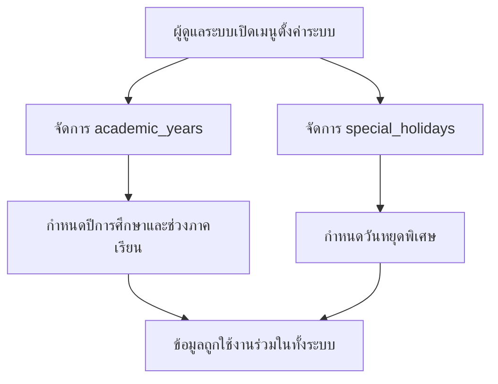
```mermaid
flowchart TD
    A["ผู้ดูแลระบบเปิดเมนูตั้งค่าระบบ"] --> B["จัดการ academic_years"]
    A --> C["จัดการ special_holidays"]
    B --> D["กำหนดปีการศึกษาและช่วงภาคเรียน"]
    C --> E["กำหนดวันหยุดพิเศษ"]
    D --> F["ข้อมูลถูกใช้งานร่วมในทั้งระบบ"]
    E --> F
```

ขั้นตอน:

1. ผู้ดูแลเปิดเมนู `ตั้งค่าระบบ`
2. สร้างหรือแก้ไข `ปีการศึกษา`
3. กำหนดวันเปิด-ปิดภาคเรียน และเลือกปีที่ active
4. เพิ่มหรือแก้ไข `วันหยุดพิเศษ`
5. ระบบบันทึกลง `academic_years` และ `special_holidays`
6. ข้อมูลเหล่านี้จะถูกใช้ต่อในเมนูเช็คชื่อ รายงาน และการเลื่อนชั้น

### 🎓 7.15 กระบวนการเลื่อนชั้นนักเรียน

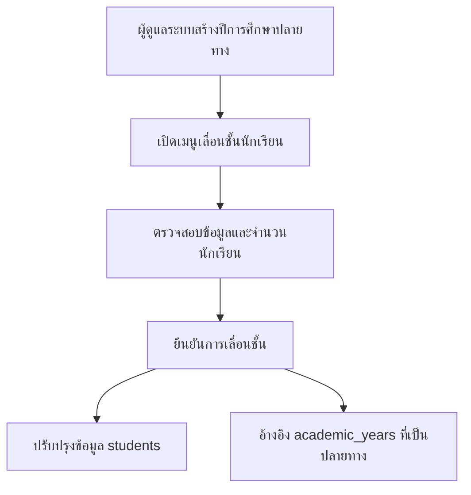
```mermaid
flowchart TD
    A["ผู้ดูแลระบบสร้างปีการศึกษาปลายทาง"] --> B["เปิดเมนูเลื่อนชั้นนักเรียน"]
    B --> C["ตรวจสอบข้อมูลและจำนวนนักเรียน"]
    C --> D["ยืนยันการเลื่อนชั้น"]
    D --> E["ปรับปรุงข้อมูล students"]
    D --> F["อ้างอิง academic_years ที่เป็นปลายทาง"]
```

ขั้นตอน:

1. ผู้ดูแลสร้างปีการศึกษาปลายทาง
2. เปิดหน้า `เลื่อนชั้นนักเรียน`
3. ระบบสรุปจำนวนนักเรียนที่จะถูกเลื่อน
4. ผู้ดูแลตรวจสอบข้อมูล
5. ยืนยันการดำเนินการ
6. ระบบอัปเดตชั้น ห้อง หรือสถานะจบการศึกษา

## 👑 8. คู่มือสำหรับผู้ดูแลระบบ

### 🚀 8.1 สิ่งที่ควรตรวจหลัง login

1. วันที่ระบบถูกต้อง
2. ปีการศึกษาที่ active ถูกต้อง
3. การ์ดสรุปข้อมูลไม่ผิดปกติ
4. ไม่มีห้องหรือรายชื่อนักเรียนหาย

### 📊 8.1.1 หน้าหลัก dashboard

วัตถุประสงค์:

- ดูสรุปข้อมูลภาพรวมของวัน
- ตรวจจำนวนขาด มาสาย ลา หรือเหตุผิดปกติ
- ใช้เป็นจุดเริ่มต้นก่อนเข้าเมนูงานประจำวัน

แนวทางการใช้งาน:

- หลัง login ระบบจะพาเข้า `/dashboard`
- ควรตรวจการ์ดสรุปและรายการล่าสุดก่อนทุกเช้า
- ถ้าตัวเลขผิดปกติ ให้ไล่ตรวจต่อที่ `เช็คชื่อ`, `มาสาย`, `ออกนอกบริเวณ`, หรือ `คะแนนความประพฤติ`

### 👤 8.2 เมนูผู้ใช้งาน

วัตถุประสงค์:

- เพิ่มผู้ใช้ใหม่
- แก้ไขข้อมูลผู้ใช้
- เปลี่ยนบทบาท
- รีเซ็ตรหัสผ่าน
- เปิดหรือปิดบัญชี

หมายเหตุ:

- เมนูนี้ใช้สำหรับ `admin`, `teacher`, `staff`
- ไม่ใช้สร้างบัญชีนักเรียน
- นักเรียนใช้เลขประจำตัวเป็นชื่อผู้ใช้และรหัสผ่านจากเมนู `รายชื่อนักเรียน`

ลำดับการใช้งาน:

1. กด `เพิ่มผู้ใช้`
2. กรอกชื่อผู้ใช้ รหัสผ่าน ชื่อ และนามสกุล
3. เลือกบทบาท เช่น `admin`, `teacher`, `staff`
4. ถ้าต้องการบังคับเปลี่ยนรหัสผ่าน ให้ตั้งค่าตอนสร้างหรือแก้ไข
5. บันทึก แล้วทดสอบ login ด้วยบัญชีนั้น

### 👩‍🏫 8.3 เมนูลงทะเบียนครู

วัตถุประสงค์:

- ดูแท็บ `คำขอลงทะเบียน`
- ดูแท็บ `เพิ่มรายชื่อครู`
- เพิ่มรายชื่อทีละคน
- import รายชื่อด้วย CSV
- ดาวน์โหลดเท็มเพลต CSV
- อนุมัติ, ไม่อนุมัติ, หรือยกเลิกคำขอที่ยังไม่อนุมัติ
- ลบรายชื่อครูที่ยังไม่ถูกอนุมัติ
- ลบคำขอลงทะเบียนที่ยังไม่ถูกอนุมัติ

แนวทางการใช้งาน:

- แท็บ `คำขอลงทะเบียน` ใช้ดูคำขอของครูที่ส่งเข้ามา
- แท็บ `เพิ่มรายชื่อครู` ใช้จัดการรายชื่อครูที่เปิดสิทธิ์ให้สมัคร
- ปุ่ม `ดาวน์โหลดเท็มเพลต`, `อัปโหลด CSV`, และ `เพิ่มรายชื่อครู` จะอยู่ในแท็บ `เพิ่มรายชื่อครู`
- ถ้าครูคนใด `อนุมัติแล้ว` รายชื่อนั้นจะแสดงเพียงสถานะ `อนุมัติแล้ว` และจะไม่แก้ไขจากเมนูนี้
- ถ้ารายชื่อครูยังไม่ถูกอนุมัติ สามารถลบออกจากรายการได้
- ถ้าคำขอลงทะเบียนยังไม่ถูกอนุมัติ สามารถลบคำขอได้
- หากต้องการเปลี่ยนข้อมูลหลังอนุมัติ ให้ไปแก้ที่เมนู `ผู้ใช้งาน` หรือ `ครูที่ปรึกษา`

### 👩‍🏫 8.4 เมนูครูที่ปรึกษา

วัตถุประสงค์:

- ผูกครูกับห้อง
- ระบุหัวหน้าระดับ
- ระบุขอบเขตการดูแล
- ให้เจ้าหน้าที่ดูข้อมูลได้แบบอ่านอย่างเดียว

### 🧑‍🎓 8.5 เมนูรายชื่อนักเรียน

วัตถุประสงค์:

- เพิ่มและแก้ไขนักเรียน
- import ข้อมูล
- ตรวจ RFID
- ตรวจคะแนนตั้งต้น
- ใช้เป็นแหล่งข้อมูล login ของนักเรียนโดยตรง
- เลือก `ระดับชั้น` และ `ห้อง` แล้วกดค้นหา
- ดูผลลัพธ์แบบแบ่งหน้า และเลือกจำนวนรายการต่อหน้า `30 / 40 / 50 / 100`

ลำดับการใช้งาน:

1. เลือก `ระดับชั้น` และ `ห้อง` หรือพิมพ์ค้นหาชื่อ/เลขประจำตัว
2. กด `ค้นหา`
3. ตรวจรายการในตาราง
4. เพิ่มหรือแก้ไขข้อมูลนักเรียนตามต้องการ
5. ถ้าจะนำเข้าจำนวนมาก ให้ใช้ไฟล์ import ตามเท็มเพลต

### 📊 8.5.1 เมนูสรุปการมาเรียน

วัตถุประสงค์:

- ดูสรุป `มา / ขาด / ลา / มาสาย / ไม่ทราบสถานะ` รายคน
- เลือกดูตาม `ปีการศึกษา`, `ภาคเรียน`, หรือ `ช่วงวันที่เอง`
- เลือก `ระดับชั้น` และ `ห้อง`
- ค้นหานักเรียนรายคน
- ดาวน์โหลดผลลัพธ์เป็น `CSV`
- เปิดหน้าพิมพ์ที่ `/attendance-summary-print`
- เปิดดูสรุปรายคนแบบย่อใน modal

ลำดับการใช้งาน:

1. เปิดเมนู `สรุปการมาเรียน`
2. เลือกปีการศึกษาและช่วงเวลาที่ต้องการ
3. ถ้าต้องการดูเฉพาะบางห้อง ให้เลือก `ระดับชั้น` และ `ห้อง`
4. กด `ค้นหา`
5. ตรวจดูการ์ดสรุปด้านบนและผลลัพธ์ในตาราง
6. ถ้าต้องการส่งต่อข้อมูล ให้กดดาวน์โหลด `CSV`

หมายเหตุ:

- ค่า `มาเรียนจริง (%)` คิดจาก `(มา + มาสาย) ÷ วันเรียนทั้งหมด`
- ค่า `ไม่ทราบสถานะ` หมายถึงวันนั้นยังไม่มีข้อมูลเช็คชื่อของนักเรียนคนนั้น
- ถ้าเป็น `ครู` ระบบจะตั้งค่าห้องของตนเองเป็นค่าเริ่มต้นให้ก่อน

### 📏 8.5.2 เมนูเกณฑ์คะแนน

วัตถุประสงค์:

- สร้างกฎคะแนนมาตรฐานของโรงเรียน
- แยกกฎ `เพิ่ม` และ `หัก`
- เปิดหรือปิดกฎที่ไม่ใช้แล้ว

ลำดับการใช้งาน:

1. เปิดเมนู `เกณฑ์คะแนน`
2. กดเพิ่มกฎใหม่ หรือเลือกแก้ไขกฎเดิม
3. กำหนดชื่อกฎ ประเภท จำนวนคะแนน และหมวดหมู่
4. บันทึก
5. ทดสอบว่าเมนู `คะแนนความประพฤติ` เรียกกฎนั้นได้ถูกต้อง

### 🧠 8.6 เมนูประเมิน SDQ

วัตถุประสงค์:

- สร้างรอบประเมิน SDQ
- ใช้งานผ่านแท็บ `ภาพรวมการประเมิน`
- ใช้งานผ่านแท็บ `จัดรอบประเมิน`
- เปิดหรือสลับรอบประเมินที่ใช้งาน
- เปิดหรือปิดช่องทาง `ครู / นักเรียน / ผู้ปกครอง`
- แก้ไขรอบประเมินที่สร้างแล้ว
- ลบรอบประเมินที่ไม่ต้องการ
- ดูว่านักเรียนแต่ละคนถูกประเมินครบกี่ฝั่งแล้ว
- ดูคะแนนสรุป SDQ ของแต่ละฝั่ง

แนวทางการใช้งาน:

- แท็บ `ภาพรวมการประเมิน` ใช้ดูสถิติ ค้นหารายชื่อ และเปิดประเมินรายคน
- แท็บ `จัดรอบประเมิน` ใช้สร้าง แก้ไข ลบ และเปิดใช้งานรอบประเมิน
- แอดมินจะเห็นส่วน `จัดการรอบประเมิน`
- ฟอร์ม `สร้างรอบประเมิน` และ `แก้ไขรอบประเมิน` เปิดเป็น modal ไม่ค้างบนหน้า
- หน้ารายชื่อนักเรียนในเมนูนี้จะยังไม่แสดงทันที จนกว่าจะเลือกตัวกรองหรือพิมพ์ค้นหาแล้วกด `ค้นหา`
- ถ้าเป็น `ครู` ระบบจะใส่ `ชั้น/ห้องที่ปรึกษา` ของตนเองเป็นค่าเริ่มต้นให้ก่อน
- ครูจะเห็นเฉพาะรายการนักเรียนที่ตนมีสิทธิ์ประเมิน
- ถ้ายังไม่มีรอบประเมิน หรือยังไม่เปิดให้ครูประเมิน ปุ่ม `ประเมิน` จะถูกล็อกไว้
- ผู้ปกครองใช้ลิงก์ `/sdq/parent` แยกจาก dashboard
- การ์ดสรุปด้านบนจะแสดงทั้ง `จำนวนคน` และ `เปอร์เซ็นต์`
- ในตารางของแต่ละฝั่งจะมี 2 badge คือ `สถานะการประเมิน` และ `ผลแปล`
- ผลแปลจะแสดงเป็น badge เช่น `ปกติ`, `เสี่ยง`, `มีปัญหา`

เกณฑ์การแปลผล:

- `0-13` = `ปกติ`
- `14-16` = `เสี่ยง`
- `17 ขึ้นไป` = `มีปัญหา`
- ระบบใช้คะแนนรวมจาก `อารมณ์`, `ความประพฤติ`, `สมาธิ/อยู่ไม่นิ่ง`, และ `เพื่อนสัมพันธ์`
- คะแนน `สัมพันธภาพทางสังคม` แสดงแยก และไม่รวมในคะแนนปัญหา

### ⚙️ 8.7 เมนูตั้งค่าระบบ

วัตถุประสงค์:

- ปีการศึกษา
- วันหยุดพิเศษ
- ช่วงเปิดภาคเรียน

ลำดับการใช้งาน:

1. สร้างหรือเลือก `ปีการศึกษา`
2. กำหนดวันเปิด-ปิดภาคเรียน
3. ตั้งให้ปีที่ถูกต้องเป็น `active`
4. เพิ่มวันหยุดพิเศษ
5. ตรวจว่าการตั้งค่าถูกใช้ในเมนูอื่นแล้ว

### 🎓 8.8 เมนูเลื่อนชั้น

วัตถุประสงค์:

- ย้ายนักเรียนไปปีถัดไป
- จบชั้นสำหรับชั้นปลาย

ลำดับการใช้งาน:

1. สร้างปีการศึกษาปลายทางก่อน
2. เปิดเมนู `เลื่อนชั้นนักเรียน`
3. ตรวจจำนวนและรายละเอียดนักเรียน
4. ยืนยันการเลื่อนชั้น
5. ตรวจซ้ำที่เมนู `รายชื่อนักเรียน`

## 👩‍🏫 9. คู่มือสำหรับครู

### 📝 9.0 การสมัครใช้งานครู

ลำดับการใช้งาน:

1. รับลิงก์หน้าสมัครจากแอดมิน
2. เลือกชื่อครูของตนเอง
3. กรอก `username`, `password`, `เบอร์โทร`, `ชั้น`, `ห้อง`
4. ส่งคำขอลงทะเบียน
5. รอแอดมินอนุมัติ
6. เมื่ออนุมัติแล้วจึง login เข้าระบบได้

### ✅ 9.1 เช็คชื่อหน้าเสาธง

ลำดับการใช้งาน:

1. ระบบจะขึ้น `ชั้น/ห้องที่ปรึกษา` ของครูก่อน
2. ถ้ามีสิทธิ์ระดับเพิ่มเติม จึงค่อยเปลี่ยนไปดูห้องอื่นในขอบเขตที่ได้รับสิทธิ์
3. เลือกห้อง
4. เช็กสถานะนักเรียน
5. ดูคำแนะนำจากใบลาถ้ามี
6. กดบันทึก

### 📊 9.1.1 สรุปการมาเรียน

ลำดับการใช้งาน:

1. เปิดเมนู `สรุปการมาเรียน`
2. ระบบจะตั้งค่าห้องของครูให้เป็นค่าเริ่มต้น
3. เลือกดู `ทั้งปี`, `ภาคเรียน`, หรือ `ช่วงวันที่เอง`
4. กด `ค้นหา`
5. ดูตารางสรุปว่านักเรียนแต่ละคน `มา / ขาด / ลา / มาสาย` กี่วัน
6. กด `ดู` เพื่อเปิดสรุปรายคนแบบย่อได้

### 🚶 9.2 ขอออกนอกบริเวณ

ลำดับการใช้งาน:

1. ค้นหานักเรียน
2. กรอกข้อมูลเวลา
3. กรอกข้อมูลปลายทางและการติดต่อ
4. กดบันทึกคำขอ

### ⭐ 9.3 คะแนนความประพฤติ

ลำดับการใช้งาน:

1. ระบบจะขึ้น `ชั้น/ห้องที่ปรึกษา` ของครูก่อน
2. เลือกชั้นและห้อง หรือค้นหานักเรียน
3. ตรวจคะแนนเดิม
4. เพิ่มหรือหักคะแนน
5. บันทึก

### 🧠 9.4 ประเมิน SDQ ของครู

ลำดับการใช้งาน:

1. เข้าเมนู `ประเมิน SDQ`
2. ระบบจะเลือก `ชั้น/ห้องที่ปรึกษา` ของครูให้เป็นค่าเริ่มต้น
3. เลือกตัวกรองหรือพิมพ์ค้นหานักเรียน แล้วกด `ค้นหา`
4. กดปุ่ม `ประเมิน`
5. ตอบคำถามทั้ง 25 ข้อ โดยปุ่มตัวเลือกจะมีขนาดพอดีกับข้อความ แสดงสี และมีไอคอนเมื่อเลือกแล้ว
6. ถ้ายังไม่เปิดรอบประเมิน หรือยังไม่เปิดให้ครูประเมิน ปุ่ม `ประเมิน` จะกดไม่ได้
7. ระบบจะยังไม่บันทึกอัตโนมัติ ต้องกด `บันทึกการประเมิน`
8. หลังบันทึก ระบบจะคำนวณผลแปลทันที
9. ตรวจดูสถานะของ `ครู / นักเรียน / ผู้ปกครอง` ในตารางสรุป
10. ดู badge ผลแปลใต้คำว่า `ประเมินแล้ว` ของแต่ละฝั่งได้ทันที

## 🧰 10. คู่มือสำหรับเจ้าหน้าที่

### ⏰ 10.1 จุดบันทึกมาสาย

ลำดับการใช้งาน:

1. สแกน RFID หรือกรอกเลขประจำตัว
2. ตรวจสอบชื่อ
3. ยืนยันการบันทึก

### 📊 10.1.1 สรุปการมาเรียน

ลำดับการใช้งาน:

1. เปิดเมนู `สรุปการมาเรียน`
2. เลือกปีการศึกษา ภาคเรียน หรือช่วงวันที่
3. เลือกระดับชั้นและห้องตามที่ต้องการดู
4. กด `ค้นหา`
5. ตรวจดูการ์ดสรุปด้านบนและตารางรายคน
6. ถ้าต้องการส่งต่อข้อมูล ให้ดาวน์โหลด `CSV`

### 🔁 10.2 จุดสแกนออก-กลับ

ลำดับการใช้งาน:

1. ตรวจว่ามีคำขอออกนอกบริเวณแล้ว
2. สแกนตอนออก
3. สแกนตอนกลับ
4. ตรวจสถานะล่าสุด

### ⭐ 10.3 คะแนนความประพฤติและเกณฑ์คะแนน

ลำดับการใช้งาน:

1. เปิดเมนู `คะแนนความประพฤติ`
2. เลือกห้องหรือค้นหานักเรียน
3. เลือกกฎคะแนนจาก `เกณฑ์คะแนน` หรือกรอกเหตุผลเอง
4. บันทึกคะแนน
5. ถ้ากฎยังไม่ครบ ให้ไปเพิ่มต่อที่เมนู `เกณฑ์คะแนน`

### 🧑‍🎓 10.4 รายชื่อนักเรียน

ลำดับการใช้งาน:

1. เปิดเมนู `รายชื่อนักเรียน`
2. เลือกตัวกรองระดับชั้นและห้อง
3. กด `ค้นหา`
4. ตรวจข้อมูลนักเรียนหรือแก้ไขข้อมูลที่ได้รับสิทธิ์

### 📏 10.4.1 เกณฑ์คะแนน

แนวทางการใช้งาน:

- เจ้าหน้าที่เปิดเมนู `เกณฑ์คะแนน` ได้
- ใช้สร้างหรือแก้ไขกฎคะแนนสำหรับเมนู `คะแนนความประพฤติ`
- ใช้เปิดหรือปิดกฎที่ไม่ต้องการใช้งานแล้ว

### 👩‍🏫 10.5 ครูที่ปรึกษา

แนวทางการใช้งาน:

- เจ้าหน้าที่เห็นเมนู `ครูที่ปรึกษา` ได้แบบอ่านอย่างเดียว
- ใช้ตรวจสอบว่าห้องใดมีครูที่ปรึกษาเป็นใคร
- ไม่ใช้สำหรับผูกหรือแก้ไขสิทธิ์ครู

### 🧠 10.6 ประเมิน SDQ

แนวทางการใช้งาน:

- เจ้าหน้าที่เห็นเมนู `ประเมิน SDQ` ได้แบบดูสรุป
- ใช้ตรวจความครบของการประเมิน `ครู / นักเรียน / ผู้ปกครอง`
- ใช้ค้นหารายชื่อนักเรียนเพื่อดูสถานะ แต่ไม่ใช้ส่งแบบประเมินแทนครู
- ดูเปอร์เซ็นต์จากการ์ดสรุป และดูผลแปลจาก badge ของแต่ละฝั่งได้

## 🧑‍🎓 11. คู่มือสำหรับนักเรียน

### 🏠 11.1 หน้าแรกนักเรียน

วัตถุประสงค์:

- คะแนนคงเหลือ
- รายการล่าสุด
- สถานะใบลา

แนวทางการใช้งาน:

- หลัง login ระบบจะพาเข้า `/student`
- ใช้หน้าแรกเพื่อตรวจสถานะล่าสุดของตัวเองก่อนเข้าเมนูย่อย
- ถ้าพบคะแนนหรือสถานะใบลาผิด ให้แจ้งครูหรือเจ้าหน้าที่ทันที

### ⭐ 11.2 ดูคะแนนความประพฤติ

วัตถุประสงค์:

- คะแนนปัจจุบัน
- เหตุผลที่ถูกหัก
- เหตุผลที่ได้รับเพิ่ม

แนวทางการใช้งาน:

- หน้าอยู่ที่ `/student/behavior`
- ใช้ดูคะแนนของตัวเองเท่านั้น
- ถ้ามีรายการใหม่ ระบบจะแสดงประวัติพร้อมคะแนนก่อนและหลังเปลี่ยน

### 📝 11.3 ยื่นใบลา

ลำดับการใช้งาน:

1. เข้าเมนูใบลาที่ `/student/leave`
2. เลือกประเภทลา
3. กรอกเหตุผล
4. บันทึก

### 🧠 11.4 ประเมิน SDQ ของนักเรียน

ลำดับการใช้งาน:

1. เข้าเมนู `ประเมิน SDQ`
2. ตอบคำถามทั้ง 25 ข้อตามความเป็นจริง
3. กด `ส่งแบบประเมิน`
4. ระบบจะคำนวณคะแนนและแสดงผลสรุปให้ทันที

แนวทางการใช้งาน:

- ถ้ายังไม่เปิดรอบประเมินสำหรับนักเรียน ระบบจะแสดงข้อความว่า `ยังไม่เปิดรอบประเมิน SDQ สำหรับนักเรียน`
- ถ้าส่งแล้ว หน้าเดิมจะแสดงผลคะแนนและผลแปลทันที
- หลังส่งแล้ว นักเรียนจะเห็นผลสรุปแทนแบบฟอร์ม

### 🚪 11.5 ออกจากระบบ

ลำดับการใช้งาน:

1. กดปุ่ม `ออกจากระบบ`
2. รอให้ระบบล้าง session
3. ระบบจะพากลับหน้า `login`

## 👨‍👩‍👧‍👦 12. คู่มือสำหรับผู้ปกครอง

### 🧠 12.1 ประเมิน SDQ ของผู้ปกครอง

ลำดับการใช้งาน:

1. เปิดลิงก์ `/sdq/parent`
2. กรอก `เลขประจำตัวนักเรียน`
3. ตรวจสอบชื่อและห้องของนักเรียนให้ถูกต้อง
4. ตอบคำถามทั้ง 25 ข้อตามพฤติกรรมของนักเรียน โดยปุ่มตัวเลือกจะแสดงสีและไอคอนเมื่อเลือกแล้ว
5. กด `ส่งแบบประเมิน`
6. ระบบจะคำนวณคะแนนและบันทึกผลให้ทันที

แนวทางการใช้งาน:

- ผู้ปกครองต้องกด `ค้นหา` ก่อนจึงจะเข้าสู่แบบประเมินได้
- ถ้านักเรียนคนนี้ถูกประเมินโดยผู้ปกครองแล้ว ระบบจะแจ้งว่า `ส่งแบบประเมิน SDQ แล้ว`
- หลังส่งแล้ว หน้าจอจะแสดงผลสรุปของผู้ปกครองแทนแบบฟอร์ม
- ถ้ายังไม่มีรอบประเมินหรือไม่พบเลขประจำตัว ระบบจะแจ้งข้อผิดพลาดบนหน้าเดียวกัน

## 🧪 13. ปัญหาที่พบบ่อย

### ❌ 13.1 login ไม่ได้

ให้ตรวจ:

1. ชื่อผู้ใช้ถูกหรือไม่
2. รหัสผ่านถูกหรือไม่
3. ถ้าเป็นนักเรียน ใช้เลขประจำตัวทั้งสองช่องหรือไม่
4. บัญชียัง active หรือไม่

### 👀 13.2 ไม่เห็นรายชื่อนักเรียน

ให้ตรวจ:

1. เลือกห้องถูกหรือไม่
2. สิทธิ์ครูถูกตั้งหรือยัง
3. นักเรียนยัง active หรือไม่

### 📊 13.2.1 สรุปการมาเรียนไม่ขึ้นข้อมูล

ให้ตรวจ:

1. กด `ค้นหา` แล้วหรือยัง
2. เลือก `ปีการศึกษา` และ `ภาคเรียน` ถูกหรือไม่
3. ถ้าเป็นครู ห้องที่เลือกอยู่ในสิทธิ์ของครูหรือไม่
4. ช่วงวันที่ที่กำหนดเองมีวันเรียนจริงหรือไม่
5. ในช่วงนั้นมีการบันทึกเช็คชื่อในระบบแล้วหรือยัง

### 📍 13.3 สแกนออกไม่ได้

ให้ตรวจ:

1. มีคำขอออกนอกบริเวณก่อนหรือยัง
2. สแกนบัตรถูกคนหรือไม่
3. คำขอเดิมยังค้างหรือไม่

### 🧠 13.4 SDQ ประเมินไม่ได้หรือไม่ขึ้นแบบฟอร์ม

ให้ตรวจ:

1. มี `รอบประเมิน SDQ` ที่เปิดใช้งานอยู่หรือไม่
2. ช่องทางของผู้ประเมินนั้นถูกเปิดไว้หรือไม่ เช่น `ครู`, `นักเรียน`, `ผู้ปกครอง`
3. ถ้าเป็นครู ปุ่ม `ประเมิน` ถูกล็อกเพราะยังไม่เปิดให้ครูหรือไม่
4. ถ้าเป็นนักเรียนหรือผู้ปกครอง อาจส่งแบบประเมินไปแล้ว ระบบจึงแสดงผลสรุปแทนแบบฟอร์ม
5. ถ้าเป็นผู้ปกครอง ตรวจเลขประจำตัวนักเรียนว่าถูกต้องหรือไม่

## 💡 14. ข้อแนะนำก่อนใช้จริง

- ควรตั้งปีการศึกษาให้ถูกก่อนเปิดใช้งาน
- ควร import นักเรียนและตรวจห้องให้ครบ
- ควรผูกครูที่ปรึกษาให้ครบก่อนวันเปิดเทอม
- ควรทดสอบจุดสแกนทุกเช้า
- ควรให้นักเรียนทดลอง login ก่อนใช้จริง
- ควรสำรองข้อมูล D1 เป็นระยะ

## ✅ 15. สรุป

ถ้าจะเริ่มใช้ระบบนี้แบบเรียงลำดับที่ถูก ควรทำดังนี้

1. ตั้งค่าปีการศึกษาและวันหยุด
2. import นักเรียน
3. สร้างผู้ใช้ครูและเจ้าหน้าที่
4. ผูกครูที่ปรึกษากับห้อง
5. ทดสอบ login ทุกบทบาท
6. ทดสอบเช็คชื่อ มาสาย ออกนอกบริเวณ สรุปการมาเรียน SDQ และพอร์ทัลนักเรียน

เมื่อดำเนินการครบทั้ง 6 ขั้นตอนดังกล่าว ระบบจะมีความพร้อมเพียงพอสำหรับการนำไปใช้งานจริงภายในสถานศึกษา
